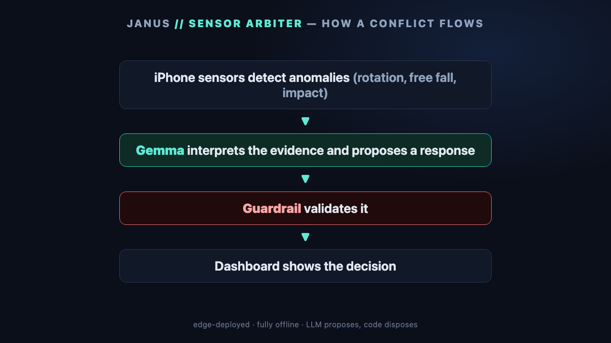

# Janus — Sensor Arbiter

**Deep-space descent fault arbitration with edge Gemma.** Named for the
two-faced Roman god of gates and transitions: Janus watches two independent
witnesses of the same motion and judges, alone, which face to believe.

A phone stands in for a spacecraft during descent. Two independent sensors
observe its rotation: the IMU gyroscope, and a **camera-derived
rotational-motion proxy computed from pixels only**. A deterministic monitor
watches the two streams at frame rate; when they persistently conflict, a
**local Gemma model is woken exactly once** to diagnose the fault, decide
which sensor (if any) to trust, and recommend a safe action. A deterministic
guardrail validates that proposal against safety invariants before it becomes
the flight decision. The dashboard shows a clearly-labeled simulated
**guarded descent** that holds a conservative attitude freeze while
arbitration runs, follows the validated verdict, and lands.

Fault class modeled: single-axis rotational-rate saturation — the same
failure mechanism as ESA's 2016 Schiaparelli loss (Ferri et al.,
EPSC2017-614).

Everything runs offline: local model via Ollama, no CDN, no cloud API.

## Quick start (no phone needed — golden replay)

```bash
python3 -m venv .venv && source .venv/bin/activate
pip install -r requirements.txt

# model (any Gemma 4 variant; see "Model choice" below)
ollama pull gemma4:e4b

# start the server
uvicorn server.main:app --host 0.0.0.0 --port 8000
```

Open http://localhost:8000/dashboard/ on the laptop, pick a golden run,
press **▶ Replay golden run**. The full demonstration — conflict, Gemma
diagnosis, guardrail validation, guarded descent outcome — runs from the
committed recording with no phone and the network off.

Headless verification of all three golden runs:

```bash
python scripts/replay_check.py                          # real Gemma verdicts
ARBITER_FORCE_FALLBACK=1 python scripts/replay_check.py # no-model fallback path
```

## Model choice

`GEMMA_MODEL` (env var or `server/config.py`) selects the Ollama model — a
one-line swap:

| model | size | measured verdict latency (24 GB MacBook) |
|---|---|---|
| `gemma4:e4b` (default) | 9.6 GB | **~2.5 s** |
| `gemma4:31b-it-qat` | 18 GB | minutes on 24 GB RAM (swaps); use only on big-RAM hosts |

Gemma runs **only on conflict** (never per frame), so a slow verdict does not
affect telemetry; the dashboard shows "diagnosing…" until it lands, and
`GEMMA_TIMEOUT_S` caps the wait before the deterministic fallback completes
the decision (labeled as such).

**Verify `GEMMA_TIMEOUT_S` on the actual demo machine.** The 15 s default is
sized for `gemma4:e4b` on the reference laptop. A slower host or a smaller
model can exceed it, and then *every* verdict silently arrives labeled
`FALLBACK` — the demo still lands, but the Gemma story is invisible. Measured
here on a Windows host:

| model | verdict latency | diagnoses correct |
|---|---|---|
| `gemma4:e2b` | 38–48 s under live load (needs `GEMMA_TIMEOUT_S=90`) | 2 of 3 — misreads `camera_dark` as `transient_disagreement` |
| `gemma3:4b` | 55–66 s | 1 of 3 — not usable for this demo |

Two things dominate that latency, and neither is obvious from the symptom
(every decision quietly labelled `FALLBACK`):

* **`num_predict` must clear the whole verdict.** Measured on `gemma4:e2b`
  after the manoeuvre fields were added: **82 s at 700, 19 s at 1100** for
  the same verdict. Schema-constrained decoding degrades sharply near the
  token ceiling. Re-check this whenever `Verdict` grows.
* **The narrator shares the model.** Ollama serialises per model, so a
  report still being written puts the next arbitration behind it in the
  queue — worth ~2x here. `NARRATOR_ENABLED=0` isolates the arbiter if
  verdicts are timing out during a busy demo.

If a run shows `FALLBACK` when Ollama is up, the timeout is too tight for the
host, not a bug. Note the deterministic fallback classifies `camera_dark`
*correctly*, so a fallback-labeled camera run can look better than a small
model's real verdict.

Note: the arbiter calls Ollama with `think=False`. Gemma 4's hidden thinking
phase can consume the whole token budget and return empty content under
schema-constrained decoding; the verdict schema already demands explicit
evidence and an alternative hypothesis.

The server warms the model at startup so the first conflict is not eaten by
model-load time. Keep Ollama running before the demo.

## Rehearse the live path without a phone (virtual phone)

Golden replay exercises the pipeline but takes the *replay* branch. To drive
the **live** path — injection buttons, live descent, `mode: live` — without a
phone, HTTPS, or a second device:

```bash
# clean stream; drive faults from the dashboard buttons
python scripts/virtual_phone.py

# scripted end-to-end landing demo: reset, then inject at t+8s
python scripts/virtual_phone.py --auto gyro_saturation
```

`scripts/virtual_phone.py` speaks the same `PhoneSample` format over the same
`/ws/phone` socket at the same 20 Hz, so everything downstream of the socket
runs unmodified — the server cannot tell it from `phone/capture.js`. Its gyro
is a hand-held wobble; its camera proxy is derived from the same motion in
proxy units with one frame of lag and independent noise, the same relationship
`scripts/make_golden.py` uses.

**Label it honestly.** It is a simulated sensor node, not a phone. It shows
the two-stream contract is satisfiable and the pipeline is correct on
correctly-*structured* data. It does **not** show that the block-matching
estimator in `capture.js` recovers rotation from real pixels — only the real
phone runs that code, so only the real phone demonstrates it.

`--source-fault SCENARIO` corrupts the stream at the source instead of on the
server, which shows the monitor detecting a fault nothing told it about.
Since the guarded descent never needs the injector's clean-value record,
source-applied faults and server-side injection tell the same descent story;
arbitration is identical either way.

Timing: the descent runs from 3700 m at 80 m/s, so the vehicle touches down
about 46 s after the stream starts. Inject within the first ~25 s, or press
**RESET** first.

## Live demo with the phone

The phone page needs **HTTPS**: `getUserMedia` and iOS `DeviceMotionEvent`
both require a secure context, and iOS requires the permission prompt to be
triggered by a user tap.

Two documented options:

**Option A — tunnel (easiest; no firewall or cert work).**

The server must run **plain HTTP** behind a tunnel — the tunnel terminates
TLS and forwards to a local HTTP port:

```bash
uvicorn server.main:app --host 0.0.0.0 --port 8000
```

*ngrok:*
```bash
ngrok config add-authtoken <token>    # once, from dashboard.ngrok.com
ngrok http 8000
```
Open `https://<your-id>.ngrok-free.app/phone/` on the phone. Note ngrok v3
starts no tunnel at all until that authtoken is configured, and the free tier
serves an interstitial page on first visit.

*cloudflared* — equivalent, and needs no account, which is handy on a machine
that is not set up with ngrok:
```bash
winget install Cloudflare.cloudflared      # or: brew install cloudflared
cloudflared tunnel --url http://localhost:8000 --no-autoupdate
```
It prints `https://<random-words>.trycloudflare.com`, new on every restart.

Either way, open `<url>/phone/` on the phone and `<url>/dashboard/` (or
`http://localhost:8000/dashboard/`) on the laptop.

Both carry WebSockets, so `/ws/phone` and `/ws/dashboard` work unchanged. The
tunnel exists only to satisfy the phone's TLS requirement — **inference stays
local**, and no sensor data leaves the laptop except to your own browser.

Note the tunnel URL is public: anyone holding it can open the dashboard and
POST `/api/inject` or `/api/reset`. There is no auth on those routes. Fine for
a demo you are running; stop the tunnel when you are done.

**Option B — LAN with a self-signed cert (fully offline):**

The cert must carry the laptop's LAN IP in a **subjectAltName**. Modern iOS
and Android reject a bare `CN=<ip>` cert outright, so `-addext` is required,
not optional.

```bash
LAN_IP=$(ipconfig getifaddr en0)          # macOS; on Windows read `ipconfig`
openssl req -x509 -newkey rsa:2048 -nodes -keyout key.pem -out cert.pem \
        -days 30 -subj "/CN=$LAN_IP" \
        -addext "subjectAltName=IP:$LAN_IP,IP:127.0.0.1,DNS:localhost"
uvicorn server.main:app --host 0.0.0.0 --port 8443 \
        --ssl-keyfile key.pem --ssl-certfile cert.pem
```

Open `https://<laptop-LAN-IP>:8443/phone/` on the phone and accept the
certificate warning (iOS: you may need to view the cert and trust it). Run
the laptop dashboard on the **same** HTTPS origin —
`https://localhost:8443/dashboard/` — because one server process is one
pipeline; a second server on another port has its own independent state and
would not see the phone at all.

Both devices must be on the same network, and the laptop must accept inbound
connections on 8443. On Windows the firewall matches the **exact executable
path**, so an existing rule for the system Python does not cover
`.venv\Scripts\python.exe`; add a port rule instead (elevated PowerShell):

```powershell
New-NetFirewallRule -DisplayName "Sensor Arbiter 8443" -Direction Inbound `
  -Protocol TCP -LocalPort 8443 -Action Allow -Profile Private,Public
```

Corporate/campus and guest Wi-Fi often enable client isolation, which blocks
phone→laptop traffic no matter what the firewall says. Use a phone hotspot or
Option A if the phone cannot reach the page.

Then:
1. On the phone: tap **ENABLE SENSORS**, grant motion + camera. Point the
   camera at a textured, well-lit scene.
2. On the laptop: open the dashboard. With the phone still or moving gently,
   both streams should plot and agree in trend.
3. Press a fault button (⚡ gyro saturation / 🕶 camera dark / 〰 transient).
   Injection is deterministic and synthetic — it overwrites the stream
   server-side before the monitor sees it, and is labeled on screen.
4. Watch: conflict state machine arms → Gemma diagnosis appears with its
   source label → the guarded vehicle rides out the conflict and lands SAFE.
5. Show all three scenarios — Gemma returns a different verdict for each,
   including trusting the **gyro** (camera dark) and merely observing
   (transient).
6. Fallback check: stop Ollama (`pkill ollama`), replay a golden run, and
   confirm the decision still lands, labeled **FALLBACK**.

## Mission log and printable reports

**Mission log** (dashboard, bottom left) — a wall-clock-stamped record of
everything significant: state transitions, injections, the arbiter waking,
verdicts, guardrail overrides, and descent beats (touchdown or impact). Each line carries both the wall clock and mission
elapsed time (`T+mm:ss.ss`); hover for the full ISO timestamp and the
sample-stream time. Sensor samples are deliberately *not* here — they stay
in the JSONL session recording, so the log never fills with frame-rate
noise. **Key events** filters to conflicts/decisions/overrides/injections;
**Clear view** clears only the screen, never the server's record.

**Reports** — a report is generated automatically the moment a decision is
made, and one whole-session report is always available.

### Gemma writes the report

The **same local Gemma model writes the report's prose** (`server/narrator.py`)
— headline, summary, what happened, why, reviewer note. This is a second,
deliberately separate use of the model:

| | arbiter (`arbiter.py`) | narrator (`narrator.py`) |
|---|---|---|
| decides | the flight decision | nothing |
| fenced by | the deterministic guardrail | numeric verification |
| runs | on conflict, in the decision path | after the decision is broadcast |
| if it fails | deterministic fallback classifier | deterministic templated text |

Because the narrator makes no decision, it is allowed to write freely where
the arbiter is not. What it may **not** do is invent facts, so the same
"propose then verify" shape is applied to prose:

1. It is handed a **fact sheet** built deterministically from the report —
   never the raw pipeline.
2. It returns a **schema-constrained** narrative (Ollama `format`), not free
   text scraped afterwards.
3. Every figure it writes is **checked back against the fact sheet**. A
   number that is not in the record fails the report, triggering one
   stricter retry and then the deterministic text.

Narration runs *after* the decision is already on the dashboard, so a slow
narration can never delay a flight decision or the telemetry. Stop Ollama
and reports still generate — labelled `DETERMINISTIC TEXT` with the reason.
The byline on every report says which engine wrote it; the tables, evidence
and timeline around the prose are always deterministic and never
model-written.

Tuning: `NARRATOR_ENABLED=0` disables it, `NARRATOR_TIMEOUT_S` caps the wait
(default 120 s; measured ~15–17 s for `gemma4:e4b`).

### What is in a report

Each answers *what happened and why* in pipeline order:

| section | contents |
|---|---|
| Summary / What happened / Why | **written by Gemma**, verified against the record |
| Decision | fault class, trusted/faulty sensor, action, confidence, source, latency |
| Guardrail override | (only when one fired) invariant violated, what the model proposed, what replaced it |
| Why this decision | 5 stages: detection → evidence → diagnosis → validation → consequence, each stating what that stage saw and what it therefore did |
| Evidence given to the arbiter | the exact compact window the arbiter received, and nothing else |
| Descent consequence | GUARDED vehicle outcome |
| Full event timeline | every logged event with both clocks |
| Governing parameters | the thresholds that actually applied, so a decision can be re-checked against its own tuning |

### Export as PDF

Press **⬇ PDF** in the Reports panel (or **Download PDF** on the report
page). The PDF is rendered **server-side** by `server/report_pdf.py` — no
browser print dialog, no manual step — and downloads as
`sensor-arbiter_<session>_<report>.pdf`. The report page still prints
directly with Cmd/Ctrl-P if paper is what you want.

ReportLab was chosen over the alternatives on purpose: WeasyPrint needs
Cairo/Pango system libraries, and driving headless Chrome would make export
depend on a browser being installed. ReportLab is a pure-Python wheel, so
`pip install -r requirements.txt` is the whole setup and PDF export works on
any judging machine, fully offline.

Attribution rule enforced throughout: the diagnosis is always credited to
whoever *proposed* it (Gemma or the fallback). The guardrail validates and
can veto — it never classifies a fault, and no report implies it did.

Endpoints, if you want the data rather than the page:

```
GET /api/log?since=<seq>          significant events since a sequence number
GET /api/reports                  index of available reports
GET /api/report/<id>.pdf          server-rendered PDF (id: session | latest | conflict-N)
GET /api/report/<id>.html         the same report as a printable page
GET /api/report/<id>.json         the same report as structured JSON
```

Reports are assembled on request from live state, never cached, so a
printed report always shows the descent outcome true at the moment it was
generated. Reports survive a **Reset** — the operator can still print what
just happened — and conflict numbering that restarts after a reset never
overwrites an earlier report.

## Fault scenarios

| button | what is injected | correct diagnosis | correct action | guarded outcome |
|---|---|---|---|---|
| ⚡ gyro saturation | gyro pinned at 34 rad/s (rail) for 10 s | `gyro_saturation`, trust camera | `switch_to_camera` | SAFE |
| 🕶 camera dark | flow confidence → ~0 for 10 s | `camera_obstruction_or_darkness`, trust gyro | `continue_with_gyro` | SAFE |
| 〰 transient | 0.4 s blip (ignored) + 2 s blip (arbitrated) | `transient_disagreement` | `observe_transient_conflict` | SAFE |

Each scenario has a committed golden run in `data/` reachable from the
dashboard with no phone.

## Attitude control — de-spin

Naming the faulty sensor is only half a response. If the vehicle is
tumbling, something still has to null the rate, and that means committing
propellant on the strength of a rate estimate the system has just finished
arguing about.

The gyro has always sent a signed `{x, y, z}` vector; everything downstream
used to reduce it to `|omega|` at ingest. The monitor now keeps the vector
and derives the **dominant spin axis**, the **signed rate** (the sign is the
direction of rotation, and therefore what a burn must oppose) and an **axis
stability** score that separates a clean single-axis spin from a tumble.

The proposer/disposer split is the same as for the diagnosis, one level
down:

| | proposes | computes | vetoes |
|---|---|---|---|
| Gemma | intent: de-spin / hold / partial, and about which axis | — | — |
| `despin.py` | — | `L = I*omega`, burn time, thrust fraction | — |
| `guardrail.py` | — | — | invariants C1–C5 |

Gemma is **never asked for a burn duration or a thrust level**. Those follow
from rigid-body mechanics, so a plausible-sounding wrong number can never
reach a thruster. It supplies the judgement; arithmetic stays in code.

### The asymmetry that makes this interesting

Only the gyro yields a signed, axis-resolved rate. The camera proxy is a
residual-**magnitude** estimate — it can say the vehicle is rotating and
roughly how fast, but not about which axis or in which direction.

So `switch_to_camera` is a perfectly good diagnosis that **forfeits attitude
control authority**: you cannot null a vector you only know the length of.
The guardrail enforces this as C1, and the dashboard shows the refusal
rather than hiding it. Watch the two live scenarios diverge:

* **camera dark** → gyro trusted → `+1.64 rad/s about z` → a **4.38 s burn
  in the negative direction** is commanded and the sim flies it
* **gyro saturation** → camera trusted → **burn refused**, attitude hold,
  with the reason stated on screen

A railed or flatlined gyro is refused for the same class of reason (C2): a
limit is not a measurement. C3 refuses a tumble, C4 refuses anything inside
the rate deadband, and C5 clamps a single burn to `DESPIN_MAX_BURN_S` — a
long open-loop burn on a disputed rate estimate is exactly the irreversible
action the guardrail exists to prevent.

Refusing to fire is never overridden. If the arbiter chose to hold while a
correction was in fact available, that is the conservative outcome and the
guardrail leaves it alone — second-guessing it would put the guardrail back
in the business of deciding.

Constants (`SPACECRAFT_INERTIA_KG_M2`, `THRUSTER_MAX_TORQUE_NM`, the
deadband, the burn cap) live in `config.py` and are demo-scale, not
flight-accurate: the mechanism is the point.

### The requirement is live, not a snapshot

The burn still required is recomputed every frame from the current body
rate, so the panel tracks reality instead of freezing on the figure that was
correct at decision time:

```
rate=+1.63  burning=True   remaining=4.3s  still_needed=4.34s @100%  settled=False
rate=+0.50  burning=True   remaining=1.3s  still_needed=1.34s @100%  settled=False
rate=+0.25  burning=True   remaining=0.7s  still_needed=0.00s @  0%  settled=True
De-spin complete — body rate +0.00 rad/s, spin nulled; no further thrust required
```

The vehicle rate is modelled as `measured + despin_offset`, where the offset
is what the thrusters have removed. Holding the post-burn value instead would
freeze the readout: spin the phone up again after a de-spin and the panel
would keep insisting the rate was zero. The burn also cuts at zero crossing
rather than reversing the spin.

## GPS altitude — the optional third sensor (OFF by default)

**The barometer is not reachable from a web page.** iOS exposes the
barometric altimeter through native CoreMotion only; the Compass app reads it
that way, a browser cannot. The only altitude available here is
`navigator.geolocation` → `coords.altitude`: GPS-derived, roughly ±10–30 m,
and frequently `null` indoors.

Against a 3700 m descent that noise is not a rounding error — a 10 m jitter
downward reads as terrain and would spuriously "land" the vehicle. So
**altitude never drives the simulated descent altitude.** It is an
observation, and when enabled it buys the arbiter one specific thing: a
**time-to-ground budget**, which decides whether a manoeuvre is affordable.
A burn that cannot finish before impact is worse than no burn — it spends
propellant and leaves the vehicle part-corrected — so `despin.py` refuses it.

The toggle is real, not cosmetic. `Hub._gate_altitude` strips the fields at
the **ingest boundary**, so with altitude off there is no path by which it
reaches the evidence, the arbiter, or a report. "Gemma ignores it" is a
property of the data flow, not a promise in a prompt.

| where | control |
|---|---|
| phone | **ENABLE ALTITUDE (GPS)** — its own permission, separate from the motion/camera tap |
| dashboard | **Altitude input: ON/OFF** |
| server | `ALTITUDE_ENABLED=1`, or `POST /api/altitude/{on\|off}` |

Fixes coarser than `ALTITUDE_MAX_ACCURACY_M` (40 m) are discarded rather than
reasoned over. An absent fix reads as **unknown**, never as ground level, and
unknown is never treated as "no time" — with the toggle off the vehicle must
not behave as though it were about to hit the ground. Both are tested.

Off by default so a venue with no sky view degrades to exactly the demo that
already works, rather than to a confusing one.

## Architecture



Trust boundary in one line: **the monitor detects, Gemma diagnoses, the
guardrail validates, deterministic fallback guarantees completion.**

Behind the four boxes: the shipped sensors are the gyro and the pixels-only
camera proxy, and "detect" happens in the deterministic monitor on the
laptop, which wakes Gemma exactly once per conflict. Server-side synthetic
fault injection corrupts the stream *before* the monitor sees it (and is
labeled on screen), every session is recorded to JSONL for replay, and the
guarded descent sim turns the validated decision into a visible landing.
Free-fall and impact sensing (accelerometer/barometer) are future witnesses,
not in the current build.

## State-machine tuning

Defaults in `server/config.py` (divergence threshold, CANDIDATE persistence,
RECOVERING agreement duration, cooldown, flow-confidence floor) are tuned
against the committed golden runs — all three pass `scripts/replay_check.py`.
Live phone tuning may differ (lighting, scene texture, hand motion); the
constants are grouped and commented for on-site adjustment.

## Gotchas handled

- iOS motion/camera permission only from a user gesture over HTTPS, with a
  clear on-page error if denied.
- Auto-reconnecting websockets on both phone and dashboard; a dropped socket
  never freezes the pipeline.
- Flow computation is downscaled, budgeted, and **drops frames** rather than
  queueing when behind.
- Gyro is calibrated rad/s, the camera proxy is uncalibrated: both are
  normalized and compared by **shape and trend**, with an adaptive scale
  learned only while the streams agree.
- Low flow confidence is displayed as *camera unreliable* rather than
  letting a dark/textureless scene silently invert the comparison.
- Hard timeout on the Gemma call; on timeout or error the deterministic
  fallback completes the decision and the dashboard labels the source.

## Repository map

```
server/    monitor.py (detect + state machine)  arbiter.py (Gemma)
           fallback.py (minimal deterministic)  guardrail.py (invariants)
           descent.py (guarded sim)  inject.py  recorder.py  main.py  config.py
           mission_log.py (event log + report assembly)
           narrator.py (Gemma writes the report prose, fact-verified)
           report_html.py (report web page)  report_pdf.py (PDF export)
phone/     index.html capture.js (gyro + pixels-only optical flow)
dashboard/ index.html dashboard.js vendor/chart.umd.min.js (pinned, local)
data/      three committed golden runs (jsonl)
           despin.py (deterministic burn sizing; the model never supplies a
                      thruster number)
scripts/   make_golden.py  replay_check.py  virtual_phone.py (simulated node)
tests/     pytest suites for schemas, monitor, guardrail, fallback, descent,
           mission log + reports, narrator, PDF export
```

Run tests: `python -m pytest tests/ -q`
